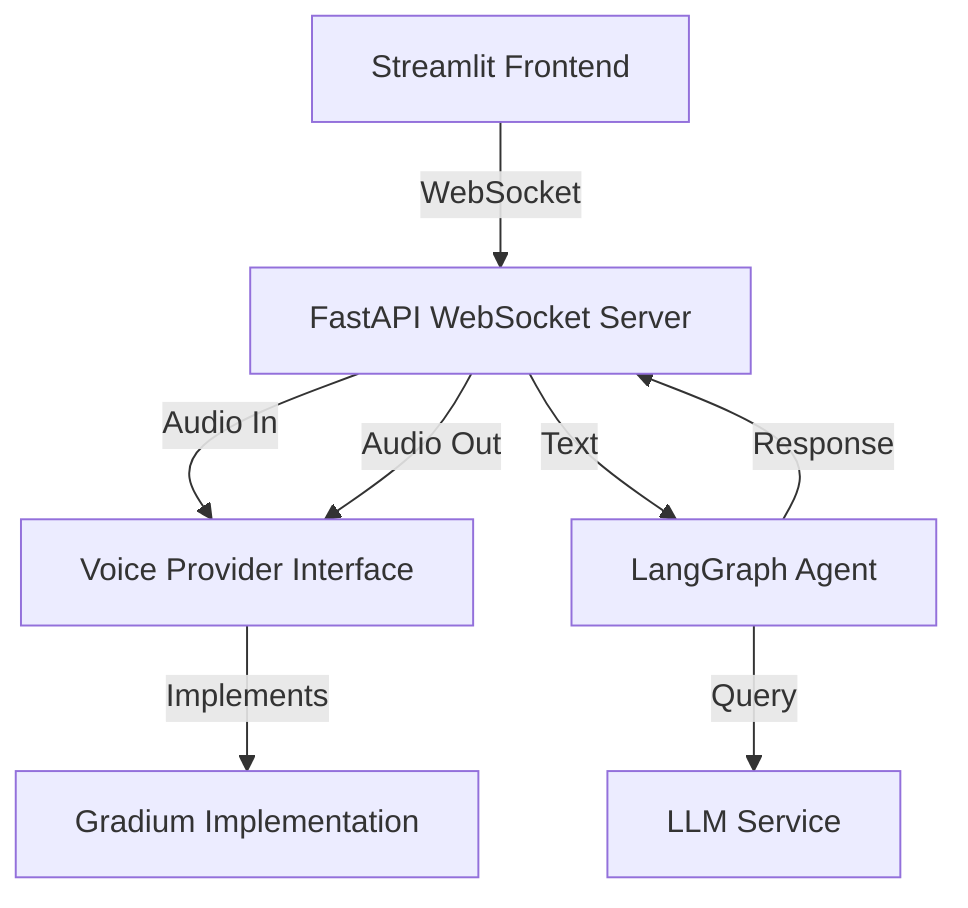

# 🎙️ Open Voice Agent

A real-time AI voice agent with excellent architecture, featuring:
- **Gradium** for low-latency speech-to-text and text-to-speech
- **LangGraph** for conversation management
- **FastAPI** WebSocket server for bidirectional audio streaming
- **Streamlit** UI for easy interaction
- **Pluggable architecture** for swapping voice and LLM providers

## 🏗️ Architecture



### Key Design Principles

1. **Provider Abstraction**: Easily swap between different voice providers (Gradium, OpenAI, ElevenLabs, etc.)
2. **Separation of Concerns**: Clean layers for voice I/O, API, agent logic, and UI
3. **Async Architecture**: Full async/await for efficient streaming
4. **Turn-Taking with VAD**: Voice Activity Detection for natural conversations
5. **Conversation Memory**: LangGraph checkpointer maintains conversation history

## 📁 Project Structure

```
src/
├── api/
│   ├── main.py              # FastAPI app with WebSocket endpoints
│   └── websocket.py         # WebSocket connection handlers
├── models/
│   └── voice/
│       ├── base.py          # Abstract base classes for voice providers
│       ├── gradium.py       # Gradium implementation
│       └── types.py         # Voice-related types and schemas
├── agent/
│   ├── graph.py             # LangGraph conversation graph
│   └── state.py             # Conversation state schema
├── core/
│   ├── settings.py          # Configuration management
│   └── logger.py            # Logging setup
└── streamlit_app.py         # Streamlit UI
```

## 🚀 Setup

### Prerequisites

- Python 3.13+
- Gradium API key ([get one here](https://gradium.ai))
- NVIDIA API key (for NVIDIA models) or Hugging Face token

### Installation

1. **Clone the repository:**
   ```bash
   git clone <repository-url>
   cd open-voice-agent
   ```

2. **Install dependencies using uv:**
   ```bash
   uv sync
   ```

   Or with pip:
   ```bash
   pip install -e .
   ```

3. **Configure environment variables:**

   Create a `.env` file in the project root:
   ```env
   # Voice Provider (Gradium)
   GRADIUM_API_KEY=your_gradium_api_key_here
   GRADIUM_VOICE_ID=YTpq7expH9539ERJ  # Emma voice (default)
   GRADIUM_REGION=eu  # or "us"
   
   # LLM Provider (NVIDIA)
   NVIDIA_API_KEY=your_nvidia_api_key_here
   NVIDIA_MODEL=meta/llama-3.1-8b-instruct
   
   # Or use Hugging Face
   # HF_TOKEN=your_huggingface_token_here
   # HF_MODEL=your_model_id
   # LLM_PROVIDER=huggingface
   
   # Optional: Override defaults
   # SAMPLE_RATE_INPUT=24000
   # SAMPLE_RATE_OUTPUT=48000
   # LLM_TEMPERATURE=0.7
   # LLM_MAX_TOKENS=1024
   ```

## 🎯 Usage

### Option 1: Run Both (Recommended)

Run both the FastAPI server and Streamlit UI:

```bash
python main.py both
```

This will start:
- FastAPI server at `http://localhost:8000`
- Streamlit UI at `http://localhost:8501`

### Option 2: Run Separately

**Start the FastAPI WebSocket server:**
```bash
python main.py api
# Or directly: uvicorn src.api.main:app --host 0.0.0.0 --port 8000
```

**Start the Streamlit UI:**
```bash
python main.py streamlit
# Or directly: streamlit run src/streamlit_app.py
```

### Using the Voice Agent

1. Open the Streamlit UI at `http://localhost:8501`
2. Select your preferred voice from the sidebar
3. Click "Test Connection" to verify the server is running
4. Click the audio input widget to start recording
5. Speak your message clearly
6. Click again to stop recording
7. Review the recorded audio (optional)
8. Click "Send Audio" to process your message
9. The AI will transcribe your speech, generate a response, and display it in the chat

**Note:** Audio is recorded in clips (not real-time streaming). For production-grade real-time streaming, a custom WebRTC component would be needed.

## 🔌 API Endpoints

### WebSocket: `/ws/voice`

Real-time bidirectional voice streaming endpoint.

**Client → Server:**
```json
{"type": "audio", "data": "<base64 audio>"}
{"type": "end_turn"}
{"type": "start_conversation"}
```

**Server → Client:**
```json
{"type": "transcript", "text": "...", "start_s": 0.0}
{"type": "vad", "inactivity_prob": 0.8, "horizon_s": 2.0}
{"type": "response_text", "text": "..."}
{"type": "audio", "data": "<base64 audio>"}
{"type": "response_complete"}
{"type": "error", "message": "..."}
```

### REST: `/health`

Health check endpoint:
```bash
curl http://localhost:8000/health
```

## 🎨 Available Voices

The system comes pre-configured with multiple Gradium voices:

- **Emma** (US, Female) - Default
- **Kent** (US, Male)
- **Eva** (GB, Female)
- **Jack** (GB, Male)
- **Elise** (FR, Female)
- **Leo** (FR, Male)
- **Mia** (DE, Female)
- **Maximilian** (DE, Male)

You can select voices in the Streamlit sidebar or configure via environment variables.

## 🔧 Configuration

All configuration is managed through environment variables and the `Settings` class in `src/core/settings.py`.

### Voice Provider Settings

| Variable | Default | Description |
|----------|---------|-------------|
| `VOICE_PROVIDER` | `gradium` | Voice provider to use |
| `GRADIUM_API_KEY` | - | Gradium API key |
| `GRADIUM_VOICE_ID` | `YTpq7expH9539ERJ` | Voice ID (Emma) |
| `GRADIUM_REGION` | `eu` | Region (eu/us) |
| `SAMPLE_RATE_INPUT` | `24000` | Input sample rate (Hz) |
| `SAMPLE_RATE_OUTPUT` | `48000` | Output sample rate (Hz) |

### LLM Settings

| Variable | Default | Description |
|----------|---------|-------------|
| `LLM_PROVIDER` | `nvidia` | LLM provider (nvidia/huggingface) |
| `NVIDIA_API_KEY` | - | NVIDIA API key |
| `NVIDIA_MODEL` | `meta/llama-3.1-8b-instruct` | NVIDIA model |
| `HF_TOKEN` | - | Hugging Face token |
| `HF_MODEL` | - | Hugging Face model ID |
| `LLM_TEMPERATURE` | `0.7` | Generation temperature |
| `LLM_MAX_TOKENS` | `1024` | Max tokens |

### API Settings

| Variable | Default | Description |
|----------|---------|-------------|
| `API_HOST` | `0.0.0.0` | Server host |
| `API_PORT` | `8000` | Server port |
| `API_WORKERS` | `1` | Number of workers |

## 🔄 Switching Providers

The architecture is designed for easy provider switching:

### Voice Providers

To use a different voice provider, implement the `BaseVoiceProvider` interface:

```python
from src.models.voice.base import BaseVoiceProvider

class MyVoiceProvider(BaseVoiceProvider):
    async def connect(self): ...
    async def disconnect(self): ...
    async def text_to_speech(self, text, stream=True): ...
    async def speech_to_text(self, audio_stream): ...
    async def get_vad_info(self): ...
```

Then update the voice provider factory in `src/api/websocket.py`.

### LLM Providers

Currently supports:
- **NVIDIA** (via `langchain-nvidia-ai-endpoints`)
- **Hugging Face** (via `langchain-huggingface`)

Set `LLM_PROVIDER` environment variable to switch between them.

## 🧪 Development

### Running Tests

```bash
# TODO: Add tests
pytest
```

### Code Quality

```bash
# Format code
black src/

# Type checking
mypy src/

# Linting
ruff check src/
```

## 📝 Environment Stages

The system supports multiple environments (dev/prod):

```bash
# Development
export OVA_STAGE=dev

# Production (default)
export OVA_STAGE=prod
```

Create `.env.dev` and `.env.prod` files for environment-specific configurations.

## 🤝 Contributing

Contributions are welcome! Please feel free to submit a Pull Request.

## 📄 License

[Add your license here]

## 🙏 Acknowledgments

- **Gradium** for excellent low-latency voice processing
- **LangChain** & **LangGraph** for conversation management
- **FastAPI** for the WebSocket server
- **Streamlit** for the UI framework

## 🐛 Troubleshooting

### WebSocket Connection Issues

- Ensure the FastAPI server is running on port 8000
- Check CORS settings in `src/core/settings.py`
- Verify WebSocket URL in Streamlit sidebar

### Audio Not Working

- Check browser permissions for microphone access
- Ensure you click "Test Connection" before recording
- Try recording a test message and playing it back
- Verify audio sample rates match configuration (24kHz input, 48kHz output)
- Ensure Gradium API key is valid and has credits
- Check browser console for JavaScript errors

### LLM Errors

- **"API key is required"**: Add `NVIDIA_API_KEY` to your `.env` file
  - Get one from https://build.nvidia.com/
  - Or switch to Hugging Face by setting `LLM_PROVIDER=huggingface` and `HF_TOKEN`
- Verify API keys are correctly set in `.env` file (no quotes, no spaces)
- Check model names match provider's available models
- Review logs in the console for detailed error messages
- Ensure you have credits/quota available on your API account

## 📚 Further Reading

- [Gradium API Documentation](https://gradium.ai/api_docs.html)
- [LangGraph Documentation](https://langchain-ai.github.io/langgraph/)
- [FastAPI WebSockets](https://fastapi.tiangolo.com/advanced/websockets/)
- [Streamlit Documentation](https://docs.streamlit.io/)
