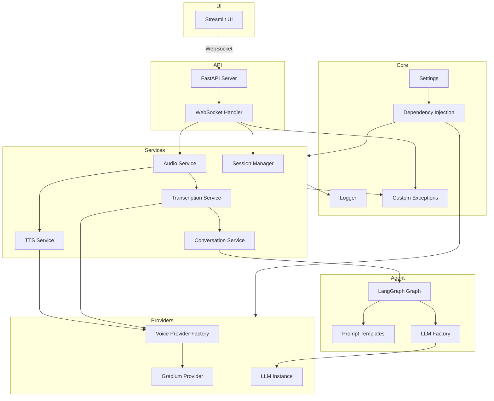

# Architecture Guide

## Overview

The Open Voice Agent follows a layered architecture with clear separation of concerns:

- **API Layer**: FastAPI WebSocket server handling client connections
- **Service Layer**: Business logic for audio, transcription, conversation, and TTS
- **Agent Layer**: LangGraph conversation flow and LLM integration
- **Provider Layer**: Pluggable voice and LLM providers
- **Core Layer**: Settings, logging, exceptions, and dependency injection

## Architecture Diagram



## Layer Details

### API Layer

**Location**: `src/api/`

**Purpose**: Handle HTTP/WebSocket connections and coordinate service calls

**Components**:
- `main.py`: FastAPI app with health endpoint and WebSocket routing
- `websocket.py`: WebSocket handler orchestrating audio I/O and services

### Service Layer

**Location**: `src/services/`

**Purpose**: Encapsulate business logic and provide reusable components

**Components**:
- `audio_service.py`: Audio buffer management
- `transcription_service.py`: Speech-to-text operations
- `conversation_service.py`: LangGraph conversation processing
- `tts_service.py`: Text-to-speech generation
- `session_manager.py`: User session lifecycle management

### Agent Layer

**Location**: `src/agent/`

**Purpose**: Define conversation flow and manage AI interactions

**Components**:
- `graph.py`: LangGraph conversation state machine
- `state.py`: Conversation state schema
- `prompts.py`: Prompt templates and management
- `llm_factory.py`: LLM provider initialization

### Provider Layer

**Location**: `src/models/voice/`

**Purpose**: Abstract external service integrations

**Components**:
- `base.py`: Abstract base classes for providers
- `gradium.py`: Gradium voice provider implementation
- `factory.py`: Provider factory with registry pattern
- `types.py`: Common data structures

### Core Layer

**Location**: `src/core/`

**Purpose**: Shared infrastructure and utilities

**Components**:
- `settings.py`: Environment-based configuration
- `logger.py`: Centralized logging
- `exceptions.py`: Custom exception hierarchy
- `dependencies.py`: Dependency injection container

## Data Flow

### Voice Conversation Flow

1. **Client connects** via WebSocket
2. **Session created** with unique UUID
3. **Audio chunks received** and buffered
4. **Turn end detected** → process buffer
5. **Transcription** via voice provider
6. **Conversation processing** via LangGraph
7. **Response generation** via LLM
8. **Text-to-speech** synthesis
9. **Audio response** streamed back

### Service Communication

Services communicate through well-defined interfaces:

```python
# WebSocket Handler → Audio Service
audio_service.add_chunk(audio_data)
chunks = audio_service.get_and_clear_buffer()

# Audio Service → Transcription Service
transcript = await transcription_service.get_full_transcript(chunks)

# Transcription → Conversation Service
result = await conversation_service.process_message(
    transcript=transcript,
    session_id=session_id,
    current_state=state
)

# Conversation → TTS Service
async for audio in tts_service.generate_speech(response_text):
    # Stream to client
```

## Design Patterns

### Factory Pattern

Used for provider instantiation:
- `VoiceProviderFactory`: Creates voice provider instances
- `LLMFactory`: Creates and caches LLM instances

### Dependency Injection

`DependencyContainer` manages service lifecycles and provides:
- Session manager singleton
- Conversation graph singleton
- Voice provider instances

### Repository Pattern

Services act as repositories:
- Hide implementation details
- Provide clean interfaces
- Enable easy testing with mocks

## Extension Points

### Adding New Voice Providers

1. Implement `BaseVoiceProvider` interface
2. Create provider-specific config class
3. Register with `VoiceProviderFactory`
4. Add configuration to settings

### Adding New LLM Providers

1. Add provider case to `LLMFactory.create_llm()`
2. Add provider settings to `LLMSettings`
3. Update settings validation

### Custom Services

1. Create service class in `src/services/`
2. Define clear interface
3. Register in dependency container
4. Inject into handlers/other services

## Testing Strategy

### Unit Tests

Test individual components in isolation:
- Mock external dependencies
- Test edge cases and error conditions
- Fast execution

### Integration Tests

Test component interactions:
- Real provider connections (optional)
- End-to-end flows
- WebSocket protocol

### Fixtures

Reusable test data and mocks:
- Mock providers
- Sample audio data
- Conversation states

## Configuration Management

### Environment-Based Config

- `.env`: Base configuration
- `.env.dev`: Development overrides
- `.env.prod`: Production overrides

### Settings Validation

Pydantic validators ensure:
- Required fields present
- Valid value ranges
- Cross-field consistency

## Error Handling

### Exception Hierarchy

```
VoiceAgentError (base)
├── VoiceProviderError
│   ├── TranscriptionError
│   └── TTSError
├── LLMError
├── SessionError
└── ConfigurationError
```

### Error Recovery

Services handle errors at appropriate levels:
- Retry transient failures
- Fallback responses for LLM errors
- Graceful degradation

## Performance Considerations

### Caching

- LLM instance cached per provider
- Conversation graph singleton
- Session manager singleton

### Streaming

- Audio streamed in chunks
- TTS responses streamed
- Reduces latency

### Resource Cleanup

- Session expiration and cleanup
- Provider disconnect on WebSocket close
- Graceful shutdown handling

## Security

### API Keys

- Never committed to repository
- Loaded from environment
- Validated on startup

### CORS

- Configurable allowed origins
- Default: localhost only

### Input Validation

- Pydantic models for all inputs
- Audio chunk size limits
- Session timeout enforcement
